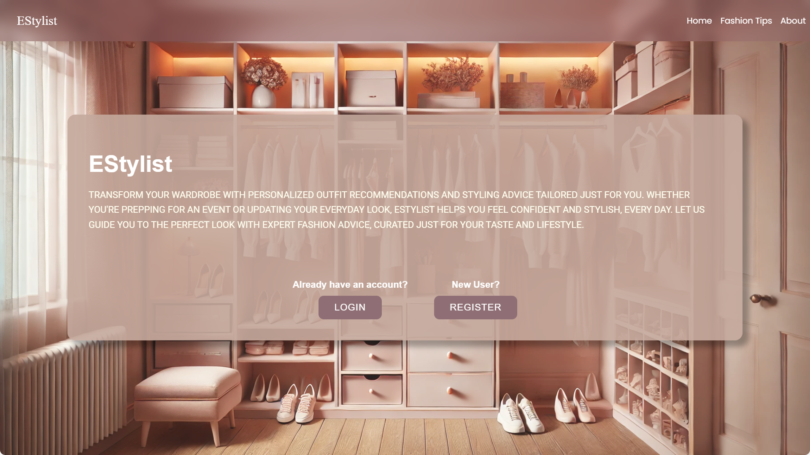
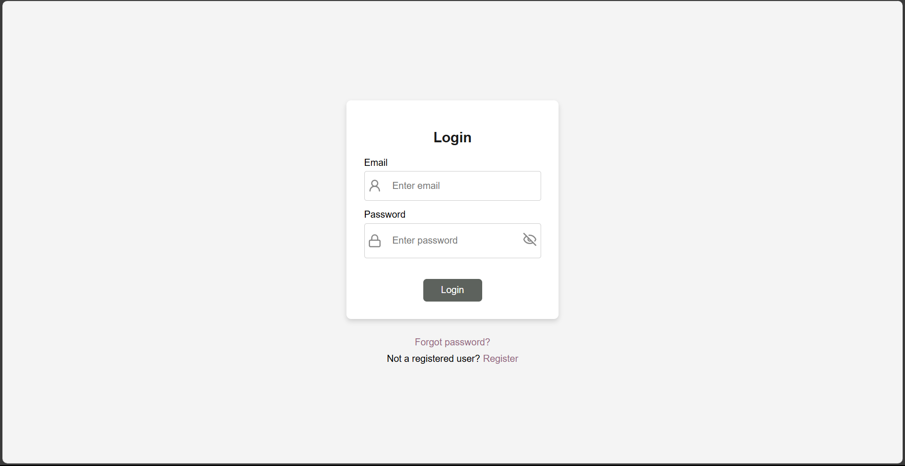
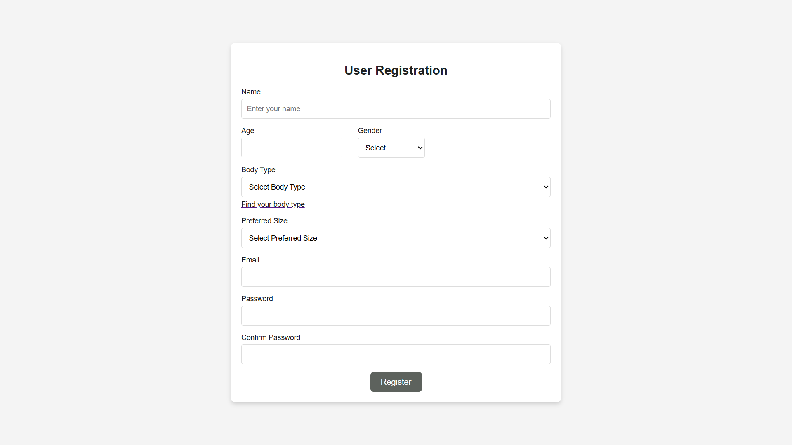
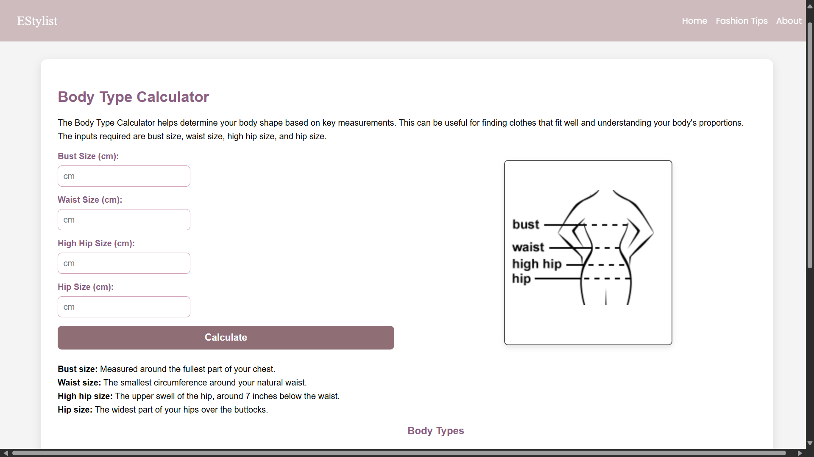
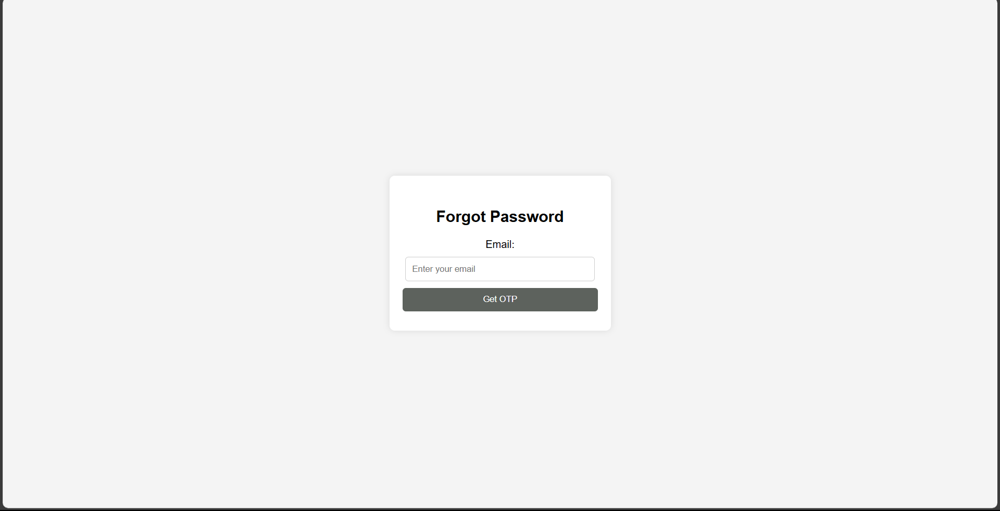
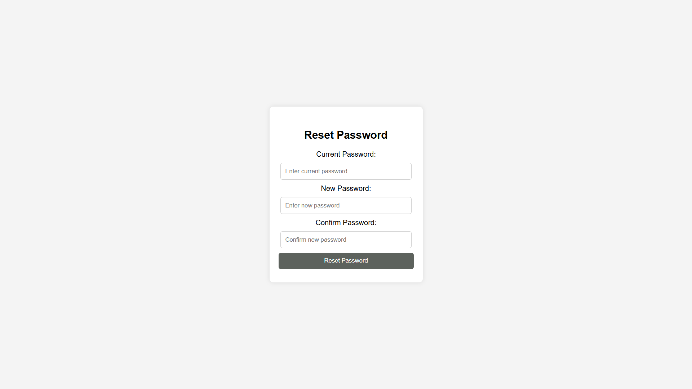
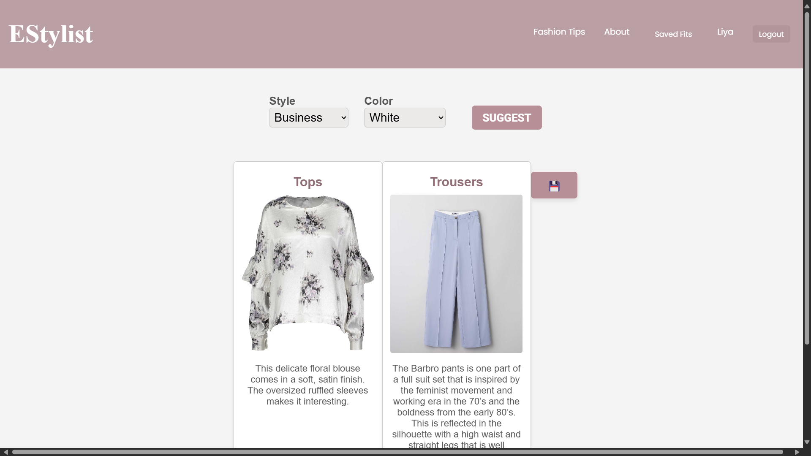
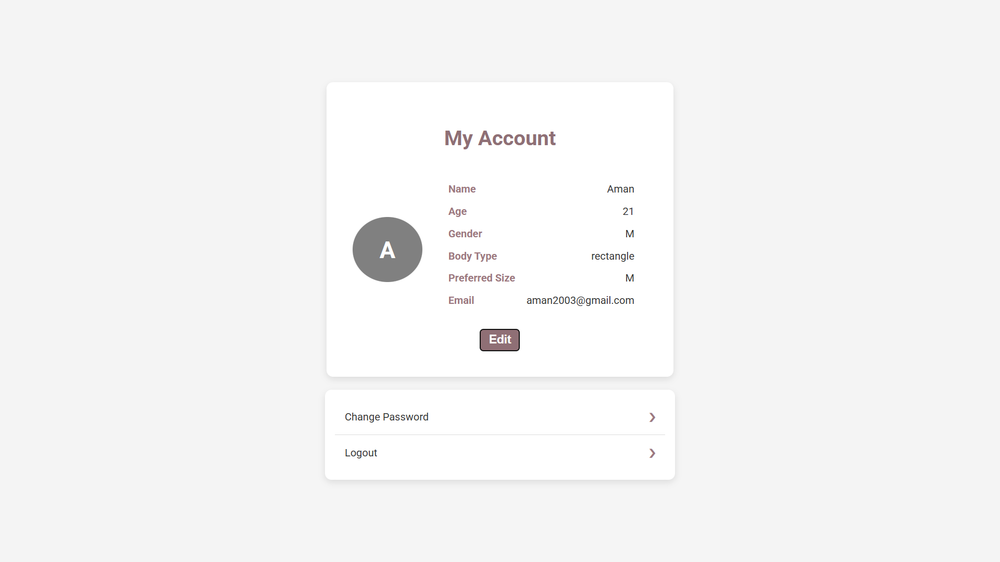
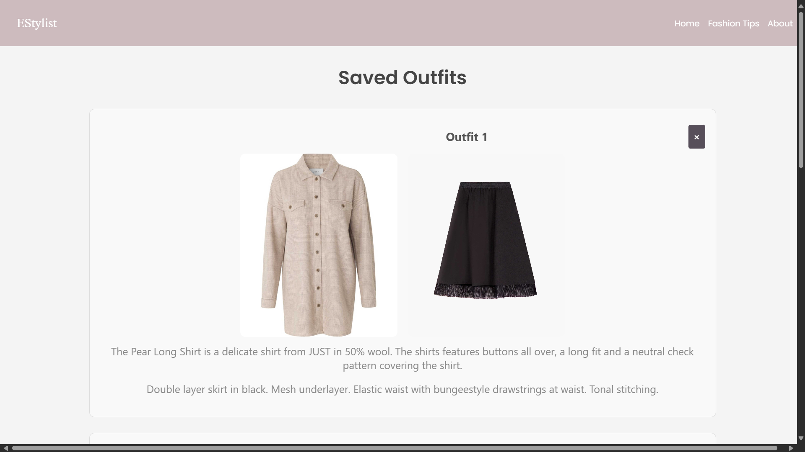
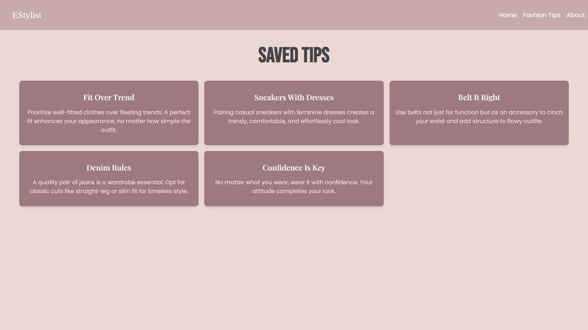

# 👗 EStylist - Fashion Recommendation System

EStylist is a **fashion stylist web application** that recommends outfit combinations based on user preferences from online datasets. 
It helps users discover clothing matches (tops, bottoms, colors, and styles) in a clean, modern interface.  

---

## 🚀 Features
- 👕 **Outfit Recommendations** - Suggests combinations of tops, bottoms, and occasionally, accessories and outerwears.  
- 🎨 **Color & Style Filters** - Choose preferences to refine results.  
- 🙂 **User Fashion Profile** - Personal profile for your fashion.
- 🧑‍🤝‍🧑 **Gender-based Datasets** - Separate recommendation logic for men’s and women’s clothing.  
- 💾 **Save Outfits** - Save chosen combinations to your collection.  
- 📃 **Styling Tips** - View and save tips for self styling clothes in your closet.
- 🕴️ **Body Type Calculator** - Calculate your body type for tailored styles.
- ⚡ **Lightweight Repo** - Dataset handled externally to keep repo size small.  

---

## ⚠️ Project Notes / Disclaimer

This is a **mini project developed by students** for learning and demonstration purposes.  

- The **UI is minimal** and may lack advanced styling.  
- Some features may be **basic or partially implemented**.  
- There are **lots of areas for improvement**, including responsiveness, performance, and additional functionalities.  

We welcome **feedback, suggestions, and contributions** to enhance the project further.

---

## 🛠️ Tech Stack
- **Frontend:** React (Vite), TailwindCSS, AntD
- **Backend:** Node.js, Express, Nodemailer  
- **Database (if applicable):** MongoDB Atlas  
- **Other:** Python (for dataset management), gdown (Google Drive integration)  

---

## 📂 Project Structure
```
EStylist/
├── client/                # Frontend (React)
│   ├── public/
│   │   └── images/        # Images folder (ignored in git, downloaded via script)
│   └── src/               # React source code
├── server/                # Backend (API / Node.js server)
├── download_dataset.py    # Script to fetch women's dataset
├── .gitignore             # Ignore large files, env, node_modules
└── README.md              # Project documentation
```

---

## 📸 Screenshots
 
 
 
 
 
 
 

 

 

---

## ⚙️ Installation & Setup

### 1️⃣ Clone the repo

```bash
git clone https://github.com/ayishaliya/EStylist.git
cd EStylist
```

### 2️⃣ Install dependencies

```bash
# Install client dependencies
cd client
npm install

# Install server dependencies
cd ../server
npm install
```

### 3️⃣ Setup environment

Create a `.env` file in the **server/** folder:

```bash
PORT=5000
DB_URI=your_database_connection
```

### 4️⃣ Download dataset

Women’s images dataset is not included in the repo.
Download it by running:

```bash
python download_dataset.py
```

This will fetch and extract images into:

```
client/public/images/
```

### 5️⃣ Run the app

```bash
# Run client
cd client
npm run dev

# Run server
cd ../server
npm start
```

---

## 📊 Dataset

* **Men’s dataset:** Pre-linked (hosted online).
* **Women’s dataset:** \~1.8 GB, downloaded via Google Drive script.
* Location after setup: `client/public/images/`

---

## 🤝 Contributing

1. Fork the repo
2. Create a new branch (`feature/my-feature`)
3. Commit changes
4. Push branch and create a Pull Request

---

## ✨ Credits & Contributors

Built with ❤️ by   
  - Contributors: 
    - [Ayisha Liya](https://github.com/ayishaliya)
    - [Amna Villan](https://github.com/amnavillan)  
    - [Sneha Sudheesh](https://github.com/snehasudheesh)  
    - [Niketh Vijay](https://github.com/Niketh-Vijay-K)  

*Dataset sourced from [Kaggle - Vibrent Clothes Rental Dataset](https://www.kaggle.com/datasets/kaborg15/vibrent-clothes-rental-dataset).*

---

## 📜 License

This project is licensed under the [MIT License](LICENSE).


---

